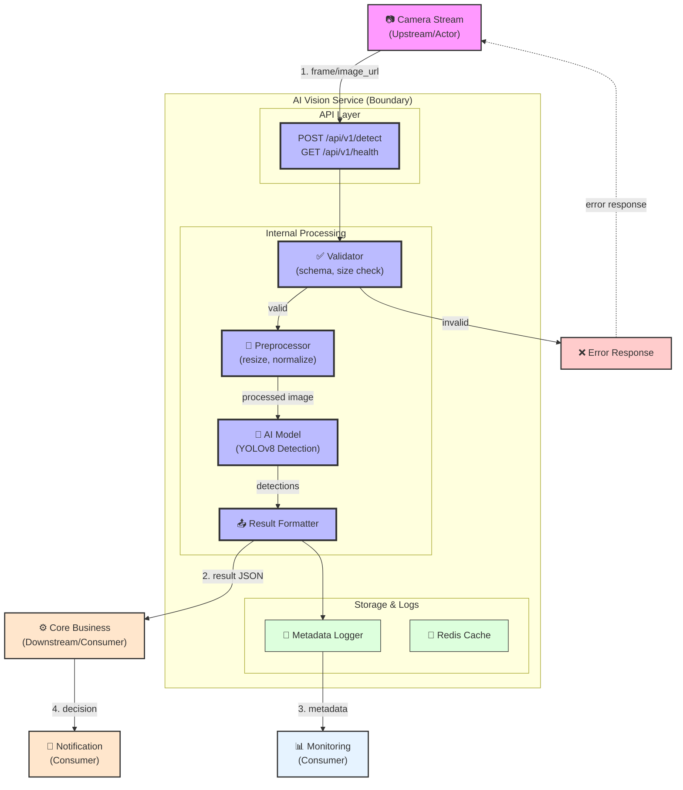
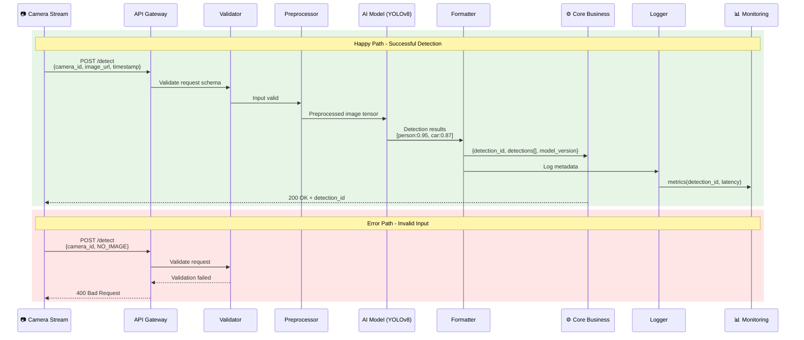

# Service Boundary

## 1. Tên Service

**AI Vision Service**

## 2. Bài toán Service giải quyết

Nhận frame/ảnh từ camera, xử lý bằng mô hình AI để phát hiện và nhận diện đối tượng (người, xe, vật thể...), trả về kết quả detection kèm confidence score cho các service downstream xử lý tiếp.

## 3. Actor

- **Camera Stream** – nguồn cung cấp frame/ảnh
- **Core Business** – service tiêu thụ kết quả detection để ra quyết định

## 4. Responsibility

- Nhận ảnh/frame từ camera
- Tiền xử lý ảnh (resize, normalize)
- Gọi mô hình AI để phát hiện đối tượng
- Trả về kết quả detection với confidence score
- Quản lý version của model AI
- Ghi log metadata (camera_id, timestamp, latency)

## 5. Out of scope

- Không quyết định có gửi cảnh báo hay không
- Không gửi Telegram/email/SMS
- Không lưu trữ ảnh gốc (chỉ log metadata)
- Không xử lý âm thanh/video stream
- Không training/updating model

## 6. Input

| Field | Type | Required | Ý nghĩa |
|-------|------|:--------:|----------|
| camera_id | string | Yes | ID duy nhất của camera nguồn |
| image_url | string | Yes* | URL đến ảnh (mutually exclusive với image_base64) |
| image_base64 | string | Yes* | Ảnh mã hóa Base64 (mutually exclusive với image_url) |
| timestamp | ISO8601 string | Yes | Thời điểm chụp ảnh |
| model_version | string | No | Version model cụ thể (default: latest) |

*Chỉ cần cung cấp 1 trong 2: image_url hoặc image_base64

## 7. Output

| Field | Type | Ý nghĩa |
|-------|------|----------|
| detection_id | UUID | ID duy nhất của detection request |
| camera_id | string | ID camera nguồn |
| detections | array | Danh sách các đối tượng phát hiện |
| model_version | string | Version model đã sử dụng |
| processing_time_ms | number | Thời gian xử lý (milliseconds) |
| timestamp | ISO8601 | Thời điểm xử lý xong |

**Detections Array Item:**

| Field | Type | Ý nghĩa |
|-------|------|----------|
| label | string | Tên nhãn đối tượng (person, car, dog...) |
| confidence | float | Độ tin cậy (0.0 – 1.0) |
| bbox | object | Bounding box {x, y, width, height} |

## 8. Provider / Consumer

| Vai trò | Entity | Mô tả |
|---------|--------|--------|
| **Provider** | AI Vision Service | Cung cấp API detection |
| **Consumer** | Camera Stream | Gửi ảnh và nhận acknowledgment |
| **Consumer** | Core Business | Tiêu thụ kết quả detection |

## 9. Upstream / Downstream

| Hướng | Entity | Giao tiếp qua |
|-------|--------|---------------|
| **Upstream** | Camera Stream | REST API (POST /detect) |
| **Downstream** | Core Business | REST API (gọi callback/push) |

## 10. API dự kiến

```
POST /api/v1/detect
Content-Type: application/json

Request:
{
  "camera_id": "cam-001",
  "image_url": "http://storage/images/frame-123.jpg",
  "timestamp": "2026-08-04T10:30:00Z"
}

Response (200 OK):
{
  "detection_id": "det-uuid-12345",
  "camera_id": "cam-001",
  "detections": [
    {
      "label": "person",
      "confidence": 0.95,
      "bbox": {"x": 100, "y": 50, "width": 80, "height": 150}
    }
  ],
  "model_version": "yolov8n-1.0",
  "processing_time_ms": 45,
  "timestamp": "2026-08-04T10:30:01Z"
}
```

## 11. Event dự kiến

| Event Name | Publisher | Payload |
|------------|-----------|---------|
| `detection.completed` | AI Vision Service | detection_id, camera_id, detections count |
| `detection.failed` | AI Vision Service | detection_id, error_code, error_message |

*Events được publish khi có notification service (buổi sau)*

## 12. Boundary Diagram

### 12.1 High-Level Architecture



### 12.2 Request/Response Flow



### 12.3 Data Flow Summary

```
┌─────────────────────────────────────────────────────────────────────────┐
│                         AI Vision Service                               │
│  ┌─────────┐    ┌──────────┐    ┌───────────┐    ┌────────────┐        │
│  │  Input  │───▶│ Validator │───▶│Processor  │───▶│  Output    │        │
│  └─────────┘    └──────────┘    └───────────┘    └────────────┘        │
│      │               │               │                 │                │
│  camera_id      schema check     Preprocess          JSON              │
│  image_url      size limit       YOLOv8            detections           │
│  timestamp      format           Cache              metadata            │
└─────────────────────────────────────────────────────────────────────────┘
     UPSTREAM            INTERNAL            INTERNAL          DOWNSTREAM
       ▼                     │                   │                  ▼
   Camera                 Redis              Redis            Core Business
   Stream                Cache              Logs             Notification
```

## 13. Vấn đề cần đàm phán ở Buổi 2

1. **Camera Stream** gửi ảnh qua REST hay message queue (Kafka/RabbitMQ)?
2. Timeout cho request detection là bao lâu? Có cần async processing không?
3. Có cần lưu trữ ảnh gốc không? Nếu có, ai quản lý storage?
4. Ngưỡng confidence tối thiểu (threshold) để coi là detection hợp lệ?
5. Có cần batch processing cho nhiều camera không?
6. Model được update như thế nào? Có A/B testing không?
