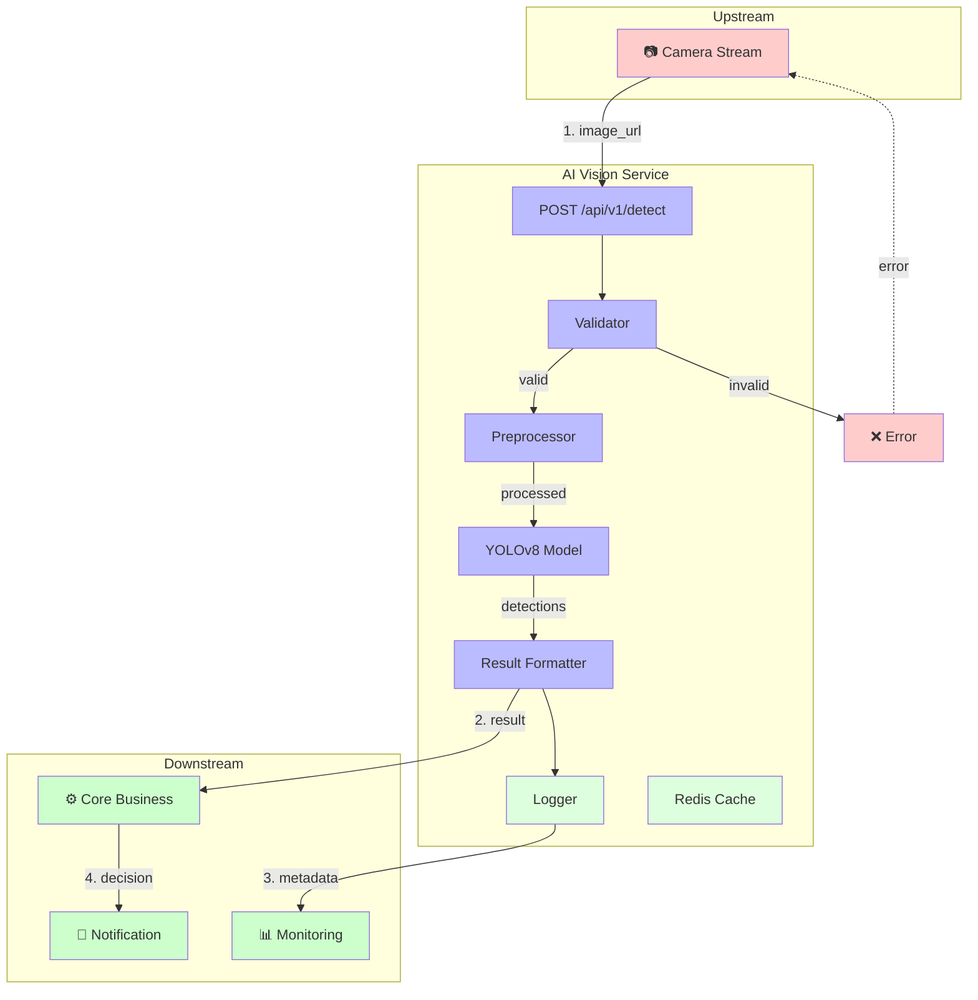
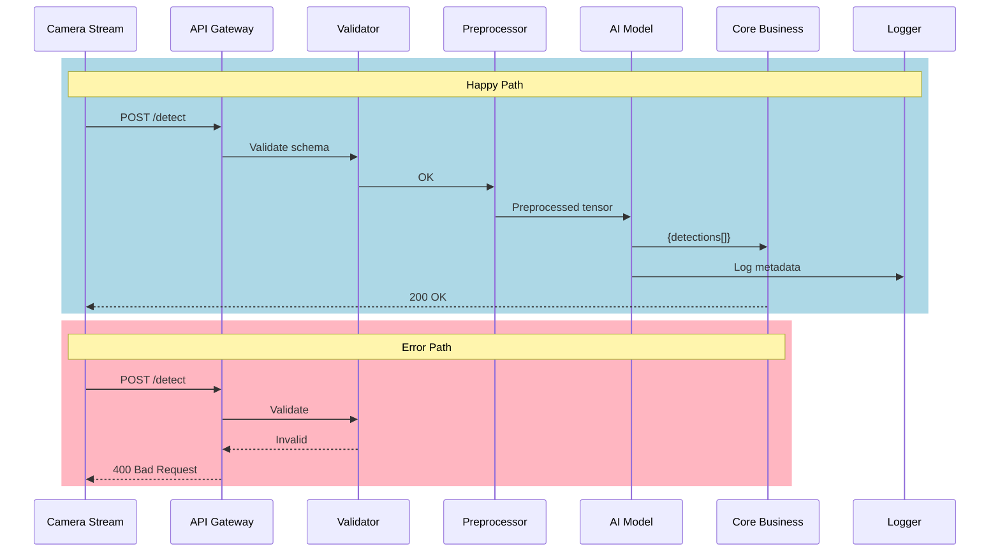
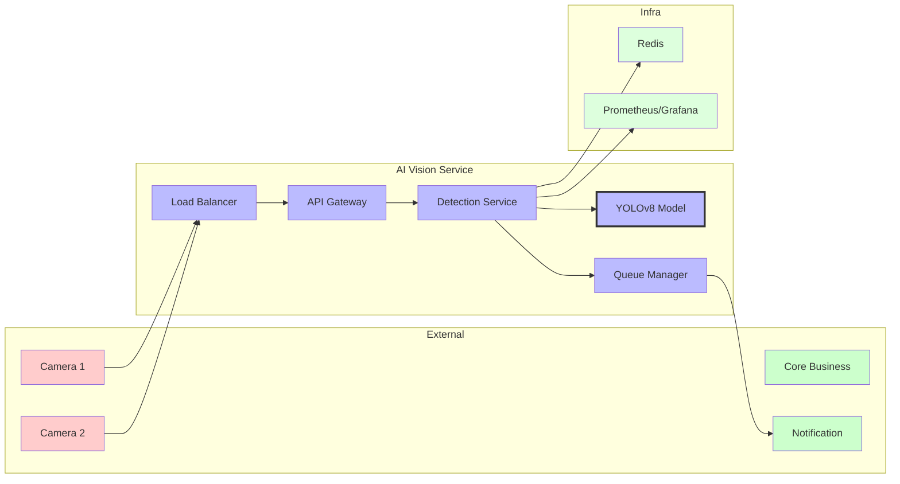
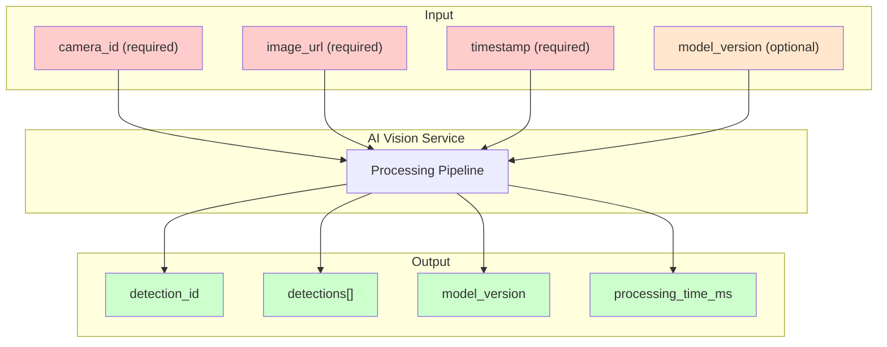
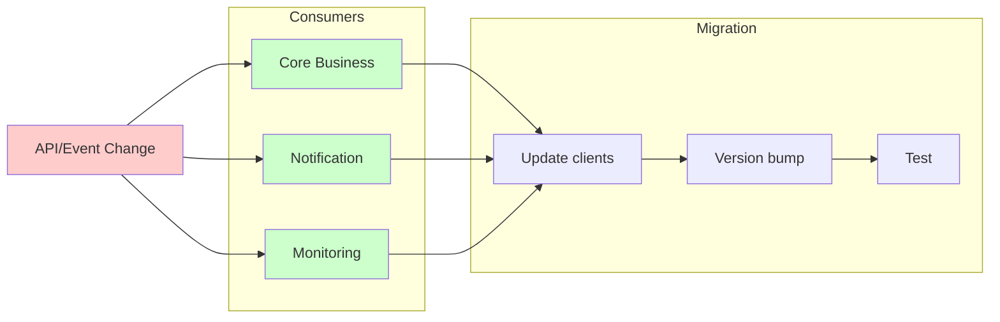

# AI Vision Service – Service Boundary Diagram

## 1. High-Level Boundary Diagram



---

## 2. Detailed Flow Diagram



---

## 3. Architecture Overview



---

## 4. Contract Definition



---

## 5. Downstream Impact Assessment



---

## Legend

| Symbol | Meaning |
|--------|---------|
| 📷 | Upstream / Actor |
| ⚙️ | Downstream / Consumer |
| 🔔 | External Service |
| 📊 | Monitoring |
| ➡️ | Sync call |
| -.- | Async call |
| 🔴 | Error path |
| 🔵 | Internal service |
| 🟢 | Downstream |
| 🟡 | Input (optional) |

---

## Data Flow Summary

```
┌─────────────────────────────────────────────────────────────────────┐
│                        AI Vision Service                            │
├─────────────────────────────────────────────────────────────────────┤
│                                                                     │
│   UPSTREAM              INTERNAL                  DOWNSTREAM        │
│       │                     │                          │             │
│   Camera ──────▶ API ───▶ Validator ───▶ YOLOv8 ──────▶ Core        │
│   Stream            │           │                       │            │
│       │            │           ▼                       │            │
│       │        Invalid    Preprocess                   │            │
│       │            │           │                       ▼            │
│       ◀────────────┘           ▼               Notification       │
│     400 Error           Result Formatter                            │
│                              │                                      │
│                              ▼                                      │
│                         Redis/Logs                                  │
│                                                                     │
└─────────────────────────────────────────────────────────────────────┘
```
